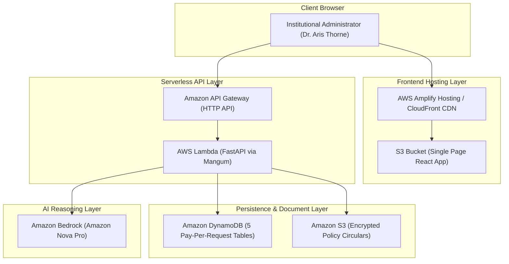

# 🚀 Ripple — Complete AWS Production Deployment Guide ("Ship It" Track)

This guide provides end-to-end instructions for deploying the **Ripple Institutional Policy Impact Engine** to Amazon Web Services using serverless architecture, Amazon Bedrock, DynamoDB, S3, and AWS Amplify / CloudFront.

---

## 🏗️ Production Cloud Architecture



---

## 📋 Step 0: Prerequisites & AWS Preparation

### 1. Authenticate AWS CLI
Ensure your AWS credentials or SSO session is active:
```powershell
# For IAM Identity Center (SSO):
aws login

# Or for standard access keys:
aws configure
```
Verify authentication:
```powershell
aws sts get-caller-identity
```

### 2. Confirm Python Runtime
The Lambda function uses `python3.13`. Confirm SAM can find Python 3.13:
```powershell
python --version
py -3.13 --version
```

### 3. Enable Amazon Bedrock Model Access
1. Open the **AWS Management Console** → Search for **Amazon Bedrock**.
2. In the left navigation, select **Model access** (under *Bedrock configurations*).
3. Click **Modify model access** or **Enable models**.
4. Select **Amazon** → **Nova Pro** if model access is not already active.
5. Click **Submit**. Access is granted in seconds.
> **Note**: The default model is `amazon.nova-pro-v1:0`, avoiding Anthropic's first-time use-case submission flow. The Lambda integration calls Bedrock directly with `boto3`.

---

## ⚙️ Step 1: Deploy Serverless Backend & Infrastructure

### Option A: Using AWS SAM CLI (Recommended)

1. **Install AWS SAM CLI** (if not already installed):
   ```powershell
   winget install Amazon.SAM-CLI
   ```
2. **Build the Serverless Package**:
   ```powershell
   sam build -t infra/template.yaml
   ```
3. **Deploy to AWS**:
   ```powershell
   sam deploy --guided `
     --stack-name ripple-policy-engine-prod `
     --region ap-south-1 `
     --capabilities CAPABILITY_IAM
   ```
   During the guided prompt:
   - Accept the default stack name (`ripple-policy-engine-prod`).
   - Choose region (e.g., `ap-south-1`).
   - Confirm authorization for unauthenticated HTTP API access (or configure Cognito).
   - Save configuration to `samconfig.toml`.

4. **Copy the Output URL**:
   At the end of deployment, SAM outputs:
   ```text
   Key: HttpApiUrl
   Value: https://<api-id>.execute-api.ap-south-1.amazonaws.com/prod
   ```
   **Save this URL** for the frontend configuration in Step 3!

---

### Option B: Using AWS CloudFormation & Zipped Lambda (Direct AWS CLI)

If you don't have SAM installed:

1. **Create an S3 Deployment Artifacts Bucket**:
   ```powershell
   $ACCOUNT_ID = (aws sts get-caller-identity --query Account --output text)
   $REGION = "ap-south-1"
   aws s3 mb "s3://ripple-artifacts-$ACCOUNT_ID-$REGION" --region $REGION
   ```

2. **Package Python Dependencies & Code**:
   ```powershell
   # In project root
   mkdir -p build_lambda
   pip install -r requirements.txt -r backend/requirements.txt mangum -t build_lambda/
   Copy-Item -Recurse backend build_lambda/
   Compress-Archive -Path build_lambda/* -DestinationPath lambda_package.zip -Force
   ```

3. **Upload Lambda Archive**:
   ```powershell
   aws s3 cp lambda_package.zip "s3://ripple-artifacts-$ACCOUNT_ID-$REGION/lambda_package.zip"
   ```

4. **Deploy CloudFormation Stack**:
   ```powershell
   aws cloudformation deploy `
     --template-file infra/template.yaml `
     --stack-name ripple-policy-engine-prod `
     --capabilities CAPABILITY_IAM `
     --region $REGION
   ```

---

## 🗄️ Step 2: Seed DynamoDB Tables and S3 Circulars

Once the stack is deployed, populate the 100-student cohort records and institutional sample policies:

```powershell
# Set environment variables for your deployed stack
$env:AWS_REGION = "ap-south-1"
$env:AWS_DYNAMODB_PREFIX = "ripple-"

# Run the automated seeder script
python scripts/seed_aws.py
```

This will automatically:
- Verify all 5 DynamoDB tables (`ripple-students`, `ripple-policies`, `ripple-rules`, `ripple-audit-ledger`, `ripple-analyses`).
- Verify the encrypted S3 bucket (`ripple-policy-circulars-*`).
- Bulk-upload all 100 synthetic student records into DynamoDB.
- Sync policy PDF and text circulars into S3.

---

## 🌐 Step 3: Deploy the Frontend Application

### Option A: AWS Amplify Hosting (1-Click UI / Fastest)

1. **Build the Production Bundle**:
   In `frontend/.env.production` (or create it), set your backend API URL:
   ```env
   VITE_API_BASE=https://<your-api-id>.execute-api.ap-south-1.amazonaws.com/prod
   ```
   Run the build:
   ```powershell
   cd frontend
   npm run build
   ```
   This generates the optimized bundle in `frontend/dist/`.

2. **Deploy via AWS Amplify Console**:
   - Open **AWS Console** → Search for **AWS Amplify**.
   - Click **Create new app** → Choose **Deploy without Git provider**.
   - App Name: `Ripple-Policy-Engine`
   - Environment Name: `prod`
   - Drag and drop the `frontend/dist` folder or upload a `.zip` of `frontend/dist`.
   - Click **Save and deploy**.
   - Your live public URL is immediately generated (e.g. `https://main.<app-id>.amplifyapp.com`).

---

### Option B: Amazon S3 Static Hosting + Amazon CloudFront (Custom Domain + CDN)

1. **Create S3 Bucket for Frontend**:
   ```powershell
   $FRONTEND_BUCKET = "ripple-ui-$ACCOUNT_ID-$REGION"
   aws s3 mb "s3://$FRONTEND_BUCKET" --region $REGION
   ```

2. **Upload Built Assets**:
   ```powershell
   aws s3 sync frontend/dist/ "s3://$FRONTEND_BUCKET" --delete
   ```

3. **Create CloudFront Distribution**:
   Create a CloudFront distribution pointing to `$FRONTEND_BUCKET` with `index.html` as the default root object and custom error response routing all 404s back to `/index.html` (for Single-Page-App routing).

---

## 🛡️ Step 4: Verification & Live Health Check

Once both backend and frontend are live:

1. **Check Backend Health**:
   ```powershell
   curl "https://<your-api-id>.execute-api.ap-south-1.amazonaws.com/prod/api/health"
   ```
   Expected response:
   ```json
   {
     "status": "healthy",
     "service": "Ripple Core Engine",
     "version": "1.0.0",
     "mode": "AWS Cloud Active",
     "aws_region": "ap-south-1",
     "aws_session": "ACTIVE"
   }
   ```

2. **Check AWS Status & Diagnostics**:
   ```powershell
   curl "https://<your-api-id>.execute-api.ap-south-1.amazonaws.com/prod/api/aws/status"
   ```

3. **Test Amazon Bedrock Inference**:
   ```powershell
   curl -X POST "https://<your-api-id>.execute-api.ap-south-1.amazonaws.com/prod/api/aws/test-bedrock"
   ```

4. **Verify in Browser**:
   - Open your Amplify / CloudFront URL.
   - Click the **AWS Cloud** badge in the header: all indicators for Bedrock, DynamoDB, and S3 will display green with active region and latency.
   - Select a scenario (e.g., *Academic Regulation 2026*), confirm the rule, and observe live deterministic cohort impact calculation!

---

## 💰 Cost Optimization & Cleanup

All AWS resources in Ripple are configured for maximum cost efficiency:
- **DynamoDB**: `PAY_PER_REQUEST` (Zero fixed cost when idle).
- **Lambda**: Only incurs cost during active execution (~100ms per rule evaluation).
- **Bedrock**: Pay per input/output token (~$0.003 per circular analyzed).
- **S3**: Standard tier with lifecycle transitions.

### To Tear Down (When Demo / Hackathon Ends):
```powershell
# Delete the CloudFormation stack
aws cloudformation delete-stack --stack-name ripple-policy-engine-prod --region ap-south-1

# Empty & delete S3 buckets
aws s3 rm "s3://$FRONTEND_BUCKET" --recursive
aws s3 rb "s3://$FRONTEND_BUCKET"
```
