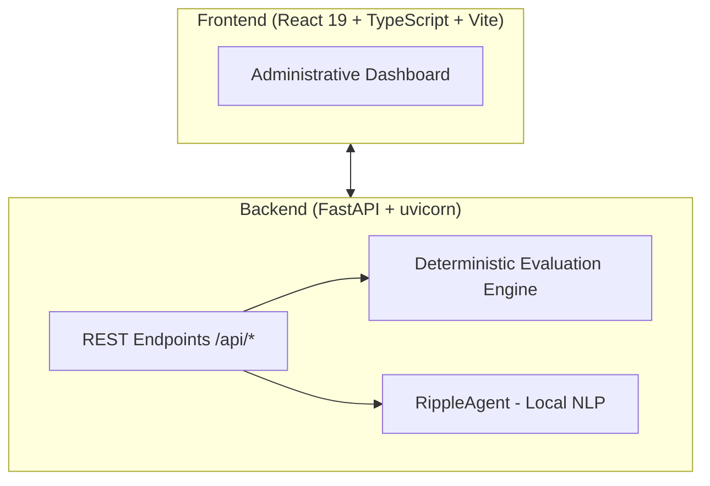
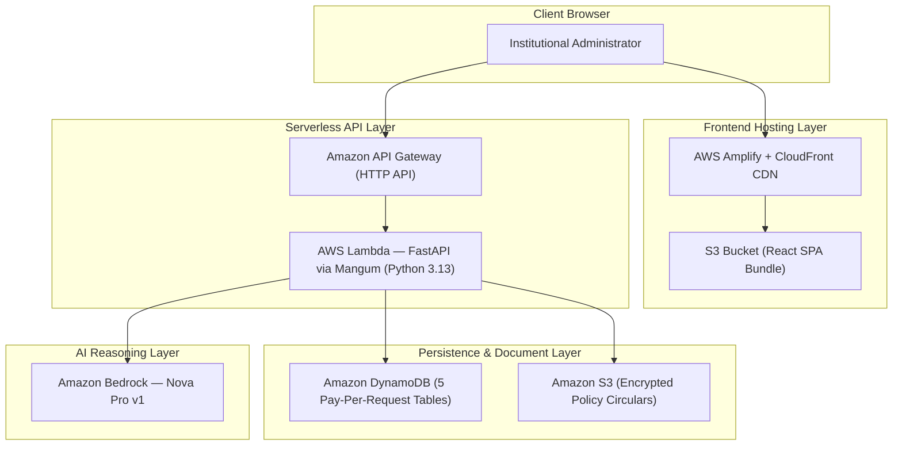

<div align="center">

# 🌊 Ripple
### Institutional Policy Impact Engine

**Turn complex institutional policy changes into personalized, evidence-backed consequences and deterministic actions.**

<p align="center">
  <a href="#-quick-start">Quick Start</a> •
  <a href="#-the-problem--solution">Why Ripple?</a> •
  <a href="#-architecture">Architecture</a> •
  <a href="#-30-second-live-demo-walkthrough">30-Second Demo</a> •
  <a href="#-features-at-a-glance">Features</a> •
  <a href="#-api-reference">API Docs</a>
</p>

[](https://fastapi.tiangolo.com)
[](https://react.dev)
[](https://www.typescriptlang.org)
[](https://tailwindcss.com)
[](https://www.python.org)
[](https://aws.amazon.com/serverless/sam/)
[-FF9900?style=for-the-badge&logo=amazonaws&logoColor=white)](https://aws.amazon.com/bedrock/)
[](https://opensource.org/licenses/MIT)

</div>

---

> [!IMPORTANT]
> **Core Architectural Guarantee**: *"LLM reasons; deterministic code validates."*  
> The AI extracts regulatory rule logic from unstructured policy circulars. **Pure, auditable Python code** executes the student mathematical evaluations. The AI never decides academic standing or eligibility.

---

## ⚡ The Problem & Solution

Universities and enterprise organizations regularly revise operational policies (attendance cutoffs, GPA thresholds, minimum credit requirements). 

| Without Ripple (Status Quo) | With Ripple (Impact Engine) |
| :--- | :--- |
| ❌ **Silent Harm**: Students find out they're debarred only *after* the final exam list is published. | ✅ **Proactive Intervention**: Instant identification of affected students with exact makeup session counts. |
| ❌ **Wasted Effort**: Administrators spend days manually cross-referencing spreadsheets with PDF circulars. | ✅ **30-Second Execution**: Automatic PDF-to-rule extraction and cohort evaluation across hundreds of records in milliseconds. |
| ❌ **Zero Traceability**: No clear legal audit trail linking an adverse decision to a specific regulation. | ✅ **100% Deterministic Evidence**: Every decision cites the source document, page, section, and boolean calculation. |

```
                       THE RIPPLE PIPELINE
                       
   📄 Upload Policy PDF ──► 🤖 AI Rule Extraction (Bedrock Nova Pro)
                                         │
                                         ▼
   📊 Instant Cohort Impact ◄── ⚖️ Deterministic Code Validation (No Hallucination)
          │                              │
          ▼                              ▼
   📬 Multi-Channel Advisory      🔍 Student-Level Evidence Ledger
     (Email, SMS, Advisor Queue)    (77.0% >= 80.0% ──► FALSE)
```

---

## ✨ Features at a Glance

- 📄 **Automated Regulatory Ingestion**: Ingests circulars (PDF/TXT), identifying threshold changes (e.g. `75%` to `80%`), scope (`S5` semester, engineering), and exact section citations (`§3.2, Page 4`).
- 🛡️ **Human-in-the-Loop Override**: Administrators review, adjust thresholds, change operators, or confirm rules before scanning records.
- 📐 **Deterministic Boolean Proofs**: Evaluates cohort records using exact math. Generates transparent proofs: `77.0% >= 80.0% -> FALSE (Deficit: -3.0%)`.
- 📬 **Batch Advisory Dispatch**: One-click multi-student notification simulation generating formal **Email letters**, **SMS alerts**, and **Advisor case tasks**.
- 📈 **Cohort Analytics**: Built-in attendance distribution histogram (`<70%` to `≥85%`), student recovery projections, and cross-department compliance matrix.
- 🗄️ **Immutable Audit History**: Chronological log of rule extractions, human confirmations, and dispatch runs with instant **Export Ledger (JSON)** and **Download CSV**.
- 🎨 **Enterprise Dark Navy Design**: Polished, professional UI built with **Plus Jakarta Sans** and **JetBrains Mono**, designed for non-technical academic administrators.
- ☁️ **Serverless-First on AWS**: Zero server management — auto-scaling Lambda, pay-per-use DynamoDB, and global Amplify CDN.

---

## 🚀 Quick Start

### Option A — Local Development

Get Ripple running locally in 3 minutes:

#### 1. Clone & Setup Backend

```bash
git clone https://github.com/your-org/ripple.git
cd ripple

# Setup virtual environment
python -m venv .venv
.venv\Scripts\activate        # Windows
# source .venv/bin/activate   # macOS/Linux

# Install dependencies
pip install -r requirements.txt

# Start FastAPI server
python -m uvicorn backend.main:app --host 127.0.0.1 --port 8000 --reload
```
> API runs at `http://127.0.0.1:8000` — Swagger docs at `http://127.0.0.1:8000/docs`

#### 2. Setup Frontend

In a new terminal:

```bash
cd frontend
npm install
npm run dev
```
> Dashboard launches at `http://localhost:5173`

---

### Option B — AWS Production Deployment

See [DEPLOYMENT_AWS.md](./DEPLOYMENT_AWS.md) for the full step-by-step guide. Quick summary:

```powershell
# 1. Deploy serverless backend (Lambda + API Gateway + DynamoDB + S3 + Bedrock)
sam build -t infra/template.yaml
sam deploy --guided

# 2. Seed DynamoDB with 100 student records + policy circulars
python scripts/seed_aws.py

# 3. Deploy frontend via AWS Amplify Console
#    Connect GitHub → tick "My app is a monorepo" → root directory: "frontend"
#    Add env var in Amplify: VITE_API_BASE = <your API Gateway URL>
```

---

## 🎯 30-Second Live Demo Walkthrough

1. **Open Dashboard** — Pre-authenticated as **Dr. Aris Thorne — Registrar**.
2. **Select Scenario** — Choose **"Academic Regulation 2026"** from the header dropdown.
3. **Review AI Extraction** — Click **"Rule: 80%"** to inspect the extracted clause (75% → 80% from §3.2, Page 4).
4. **Confirm Rule** — Click **"Confirm & Scan Students"**.
5. **Inspect Cohort Impact** — KPI cards instantly update:
   - **Needs Attention**: `34 students` (below 80%)
   - **Borderline**: `20 students` (within 5% risk buffer)
   - **Passing Rate**: `58%`
6. **Inspect Student Proof** — Click **Elena Rostova** (`S002`) to view the Evidence Drawer:
   - Current: `70.0%` vs. Required: `80.0%` — Deficit: `10.0%`
   - Recovery: *Must attend at least 3 remaining sessions.*
7. **Batch Advisory** — Check 3 students → **"Send Notices (3)"** → **"Dispatch Notices"**.
8. **View Analytics** — Switch to **"Cohort Analytics"** for the histogram and compliance matrix.

---

## 🏛️ Architecture

### Local Development



### AWS Production Architecture



| Layer | Technology | Purpose |
| :--- | :--- | :--- |
| **Frontend** | React 19 + Vite + TypeScript + Tailwind | Admin dashboard SPA |
| **Hosting** | AWS Amplify + CloudFront | Global CDN, auto-deploy from GitHub |
| **API** | Amazon API Gateway (HTTP) | Public HTTPS endpoints |
| **Compute** | AWS Lambda + Mangum | Serverless FastAPI runtime |
| **AI Reasoning** | Amazon Bedrock (Nova Pro) | Rule extraction from PDF circulars |
| **Database** | Amazon DynamoDB (5 tables) | Students, policies, rules, audit, analyses |
| **Document Store** | Amazon S3 | Encrypted policy circular storage |
| **IaC** | AWS SAM (`infra/template.yaml`) | One-command infrastructure deployment |

---

## 🔌 API Reference

| Method | Endpoint | Description |
| :--- | :--- | :--- |
| `GET` | `/api/health` | Health check & AWS connectivity status |
| `GET` | `/api/policies/samples` | List pre-loaded institutional circulars |
| `POST` | `/api/policies/upload` | Upload and parse new policy PDF / document |
| `POST` | `/api/rules/extract` | AI extraction of rule predicate and source citations |
| `POST` | `/api/rules/confirm` | Record human administrator review and rule overrides |
| `POST` | `/api/analyses/run` | Run deterministic evaluation across student records |
| `POST` | `/api/notifications/simulate` | Generate personalized email, SMS, and counselor tasks |
| `GET` | `/api/audit/logs` | Fetch immutable audit logs and exportable compliance records |
| `GET` | `/api/aws/status` | AWS service connectivity diagnostics |
| `POST` | `/api/aws/test-bedrock` | Verify Amazon Bedrock inference is reachable |

> Interactive Swagger docs available at `/docs` when running locally.

---

## 🗂️ Project Structure

```text
ripple/
├── backend/                         # Python FastAPI application
│   ├── agents/
│   │   └── ripple_agent.py          # Strands reasoning agent (Bedrock Nova Pro)
│   ├── api/routes/                  # FastAPI REST endpoints
│   ├── data/                        # Sample circulars & 100-student cohort dataset
│   ├── models/                      # Pydantic schemas (Rule, Impact, Student)
│   ├── repositories/                # DynamoDB persistence & audit trail
│   ├── services/
│   │   ├── evaluation_engine.py     # Pure deterministic validation engine
│   │   ├── attendance_calculator.py # Recovery session math
│   │   └── document_parser.py       # PDF/text ingestion
│   ├── lambda_handler.py            # Mangum adapter — AWS Lambda entrypoint
│   └── main.py                      # FastAPI app entrypoint
├── frontend/                        # React 19 + Vite + TypeScript SPA
│   ├── src/
│   │   ├── components/              # Roster, Evidence, Analytics, Drawers
│   │   ├── services/api.ts          # Strongly-typed API client
│   │   ├── types/                   # TypeScript interfaces
│   │   ├── App.tsx                  # Main application orchestrator
│   │   └── index.css                # Plus Jakarta Sans & design tokens
│   ├── tailwind.config.js
│   └── vite.config.ts
├── infra/
│   └── template.yaml                # AWS SAM CloudFormation template
├── scripts/
│   └── seed_aws.py                  # DynamoDB & S3 data seeder
├── samconfig.toml                   # SAM deploy config (region: ap-south-1)
├── requirements.txt                 # Python dependencies
└── DEPLOYMENT_AWS.md                # Full AWS production deployment guide
```

---

## 🔒 Privacy & Compliance (FERPA)

Ripple is designed from the ground up for privacy and educational compliance:

- **Offline-First**: Can run 100% locally with zero external API dependencies.
- **Data Isolation**: Student records, grades, and personal identifiers never leave the institution's AWS account.
- **Human Accountability**: All automated evaluations require human administrator sign-off before notices are generated.
- **Serverless Isolation**: Each Lambda invocation is ephemeral — no persistent compute retaining student data in memory.

---

## 💰 AWS Cost Estimate

All resources use pay-per-use pricing — **zero fixed cost when idle**:

| Service | Pricing Model | Est. Demo Cost |
| :--- | :--- | :--- |
| AWS Lambda | Per invocation + duration | ~$0.00 (free tier) |
| Amazon API Gateway | Per million requests | ~$0.00 (free tier) |
| Amazon DynamoDB | Pay-per-request | ~$0.00 (free tier) |
| Amazon S3 | Per GB stored | ~$0.01 |
| Amazon Bedrock (Nova Pro) | Per input/output token | ~$0.003 per circular |
| AWS Amplify Hosting | Per build minute + GB served | ~$0.01 |

---

## 📄 License

Distributed under the **MIT License**. See `LICENSE` for more information.

<div align="center">
  <sub>Built for the Institutional Policy Impact Hackathon. Designed for registrars, academic deans, and students.</sub>
</div>
