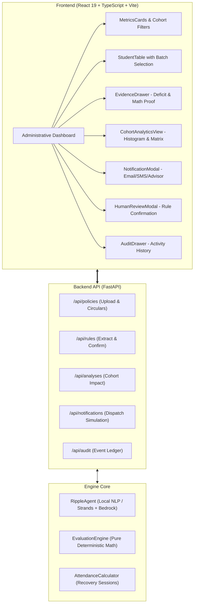

<div align="center">

# 🌊 Ripple
### Institutional Policy Impact Engine

**Turn complex institutional policy changes into personalized, evidence-backed consequences and deterministic actions.**

<p align="center">
  <a href="#-quick-start">Quick Start</a> •
  <a href="#-the-problem--solution">Why Ripple?</a> •
  <a href="#-architecture--principles">Architecture</a> •
  <a href="#-live-demo-flow">30-Second Demo</a> •
  <a href="#-features">Features</a> •
  <a href="#-api-reference">API Docs</a>
</p>

[](https://fastapi.tiangolo.com)
[](https://react.dev)
[](https://www.typescriptlang.org)
[](https://tailwindcss.com)
[](https://www.python.org)
[](https://opensource.org/licenses/MIT)

</div>

---

> [!IMPORTANT]
> **Core Architectural Guarantee**: *"LLM reasons; deterministic code validates."*  
> The AI extracts regulatory rule logic from unstructured policy circulars. **Pure, auditable Python code** executes the student mathematical evaluations. The AI never decides academic standing or eligibility.

---

## ⚡ The Problem & Solution

Universities and enterprise organizations regularly revise operational policies (attendance cutoffs, GPA thresholds, minimum credit requirements). 

| Without Ripple (Status Quo) | With Ripple (Impact Engine) |
| :--- | :--- |
| ❌ **Silent Harm**: Students find out they're debarred only *after* the final exam list is published. | ✅ **Proactive Intervention**: Instant identification of affected students with exact makeup session counts. |
| ❌ **Wasted Effort**: Administrators spend days manually cross-referencing spreadsheets with PDF circulars. | ✅ **30-Second Execution**: Automatic PDF-to-rule extraction and cohort evaluation across hundreds of records in milliseconds. |
| ❌ **Zero Traceability**: No clear legal audit trail linking an adverse decision to a specific regulation. | ✅ **100% Deterministic Evidence**: Every decision cites the source document, page, section, and boolean calculation. |

```
                       THE RIPPLE PIPELINE
                       
   📄 Upload Policy PDF ──► 🤖 AI Rule Extraction (Metric, Operator, Scope, Section)
                                         │
                                         ▼
   📊 Instant Cohort Impact ◄── ⚖️ Deterministic Code Validation (No Hallucination)
          │                              │
          ▼                              ▼
   📬 Multi-Channel Advisory      🔍 Student-Level Evidence Ledger
     (Email, SMS, Advisor Queue)    (77.0% >= 80.0% ──► FALSE)
```

---

## ✨ Features at a Glance

- 📄 **Automated Regulatory Ingestion**: Ingests circulars (PDF/TXT), identifying threshold changes (e.g. `75%` to `80%`), scope (`S5` semester, engineering), and exact section citations (`§3.2, Page 4`).
- 🛡️ **Human-in-the-Loop Override**: Administrators review, adjust thresholds, change operators, or confirm rules before scanning records.
- 📐 **Deterministic Boolean Proofs**: Evaluates cohort records using exact math ($actual \ge required$). Generates transparent proofs: `77.0% >= 80.0% -> FALSE (Deficit: -3.0%)`.
- 📬 **Batch Advisory Dispatch**: One-click multi-student notification simulation generating formal **Email letters**, **SMS alerts**, and **Advisor case tasks**.
- 📈 **Cohort Analytics**: Built-in attendance distribution histogram (`<70%` to `≥85%`), student recovery projections, and cross-department compliance matrix.
- 🗄️ **Immutable Audit History**: Chronological log of rule extractions, human confirmations, and dispatch runs with instant **Export Ledger (JSON)** and **Download CSV**.
- 🎨 **Enterprise Dark Navy Design**: Polished, professional UI built with **Plus Jakarta Sans** and **JetBrains Mono**, designed for non-technical academic administrators.

---

## 🚀 Quick Start

Get Ripple running locally in 3 minutes:

### 1. Clone & Setup Backend

```bash
git clone https://github.com/your-org/ripple.git
cd ripple

# Setup virtual environment
python -m venv .venv
source .venv/bin/activate  # On Windows: .venv\Scripts\activate

# Install dependencies
pip install -r requirements.txt

# Start FastAPI server
python -m uvicorn backend.main:app --host 127.0.0.1 --port 8000 --reload
```
> API will run at `http://127.0.0.1:8000` (Interactive Swagger Docs: `http://127.0.0.1:8000/docs`)

### 2. Setup Frontend

In a new terminal:

```bash
cd frontend
npm install
npm run dev
```
> Dashboard will launch at `http://localhost:3000`

---

## 🎯 30-Second Live Demo Walkthrough

Try the core evaluation scenario:

1. **Open Dashboard**: Go to `http://localhost:3000` (Pre-authenticated as **Dr. Aris Thorne — Registrar**).
2. **Select Scenario**: From the top header dropdown, select **"Academic Regulation 2026"**.
3. **Review AI Extraction**: Click **"Rule: 80%"** to inspect the extracted clause ($75\% \to 80\%$ attendance requirement from Section §3.2, Page 4).
4. **Confirm Rule**: Click **"Confirm & Scan Students"**.
5. **Inspect Cohort Impact**: The KPI cards instantly update:
   - **Needs Attention**: `34 students` (Deficit below 80%)
   - **Borderline**: `20 students` (Meeting 80%, but within 5% risk buffer)
   - **Passing Rate**: `58%`
6. **Inspect Student Proof**: Click **Elena Rostova** (`S002`) to view the Evidence Drawer:
   - Current: `70.0%` vs. Required: `80.0%`
   - Deficit: `10.0% below requirement`
   - Recovery math: *Must attend at least 3 remaining sessions*.
7. **Batch Advisory**: Check 3 students in the table, click **"Send Notices (3)"**, preview the personalized multi-channel notice, and click **"Dispatch Notices"**.
8. **View Analytics**: Switch to the **"Cohort Analytics"** sub-navigation tab to see the attendance distribution histogram and department compliance breakdown.

---

## 🏛️ System Architecture



---

## 🔌 API Reference

| Method | Endpoint | Description |
| :--- | :--- | :--- |
| `GET` | `/api/policies/samples` | List pre-loaded institutional circulars |
| `POST` | `/api/policies/upload` | Upload and parse new policy PDF / document |
| `POST` | `/api/rules/extract` | AI extraction of rule predicate and source citations |
| `POST` | `/api/rules/confirm` | Record human administrator review and rule overrides |
| `POST` | `/api/analyses/run` | Run deterministic evaluation across student records |
| `POST` | `/api/notifications/simulate` | Generate personalized email, SMS, and counselor tasks |
| `GET` | `/api/audit/logs` | Fetch immutable audit logs and exportable compliance records |

---

## 🗂️ Project Structure

```text
├── backend/
│   ├── agents/
│   │   └── ripple_agent.py          # Strands reasoning agent (Bedrock-ready + Local NLP)
│   ├── api/routes/                  # FastAPI REST endpoints
│   ├── data/                        # Sample circulars & student cohort datasets
│   ├── models/                      # Pydantic schemas (Rule, Impact, Student)
│   ├── repositories/                # Persistence & audit trail storage
│   ├── services/
│   │   ├── evaluation_engine.py     # Pure deterministic validation engine
│   │   ├── attendance_calculator.py # Future recovery session math
│   │   └── document_parser.py       # PDF/text ingestion
│   └── main.py                      # Server entrypoint
├── frontend/
│   ├── src/
│   │   ├── components/              # Roster, Evidence, Analytics, Drawers
│   │   ├── services/api.ts          # Strongly-typed API client
│   │   ├── types/                   # TypeScript interfaces
│   │   ├── App.tsx                  # Main application orchestrator
│   │   └── index.css                # Plus Jakarta Sans & design tokens
│   └── tailwind.config.js
├── ripple-prd.md                    # Full Product Requirements Document
└── requirements.txt                 # Python dependencies
```

---

## 🔒 Privacy & Compliance (FERPA)

Ripple is designed from the ground up for privacy and educational compliance:
- **Offline-First**: Can run 100% locally with zero external API dependencies.
- **Data Isolation**: Student records, grades, and personal identifiers never leave the institution.
- **Human Accountability**: All automated evaluations require human administrator sign-off before notices are generated.

---

## 📄 License

Distributed under the **MIT License**. See `LICENSE` for more information.

<div align="center">
  <sub>Built for the Institutional Policy Impact Hackathon. Designed for registrars, academic deans, and students.</sub>
</div>
